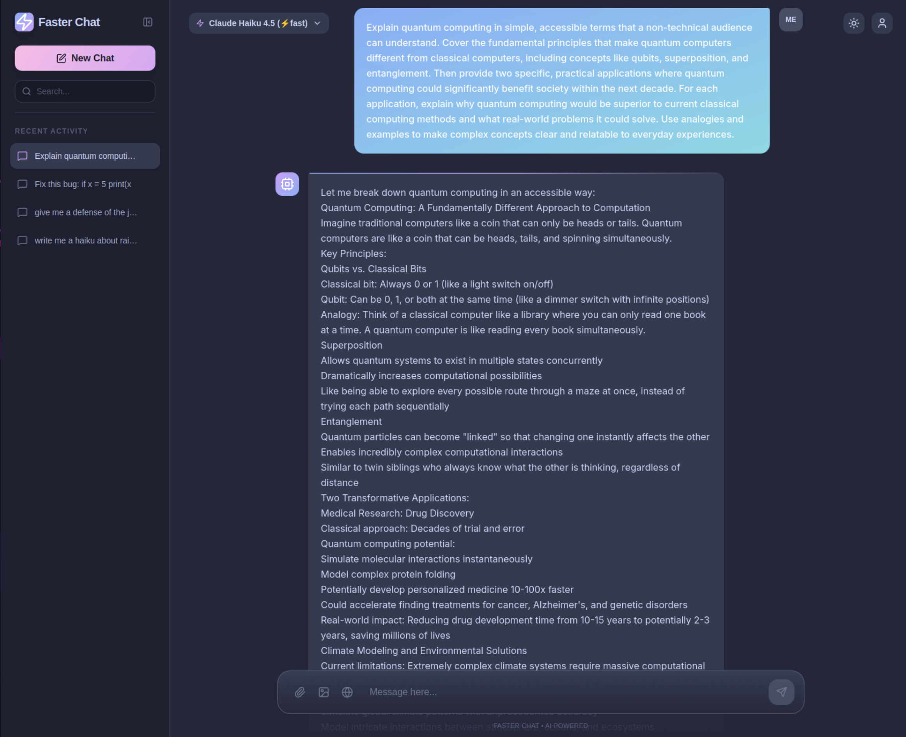
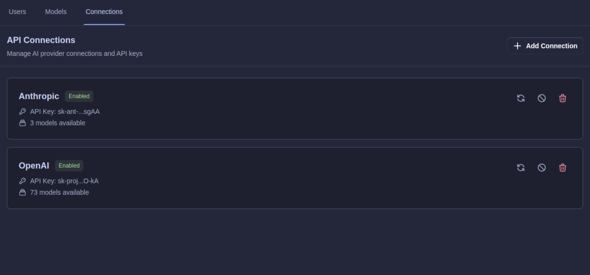
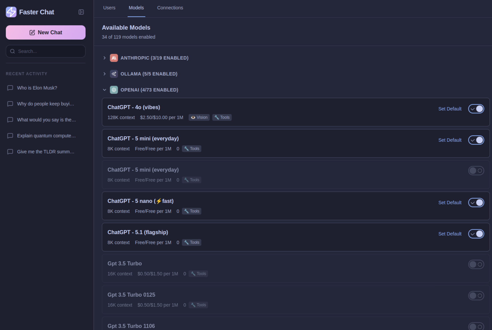
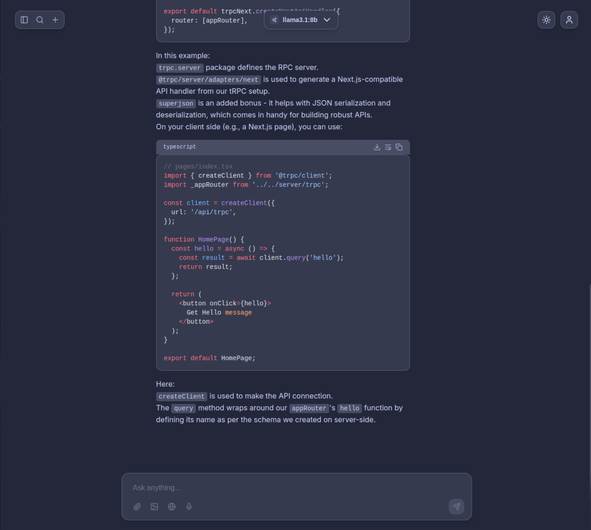
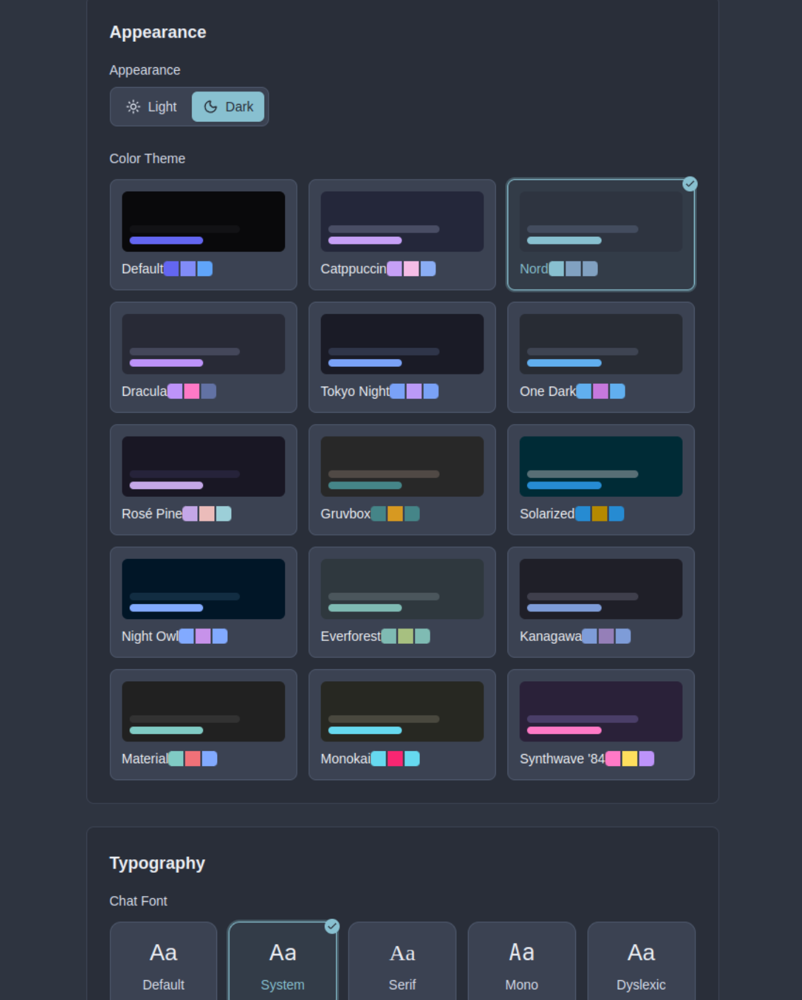
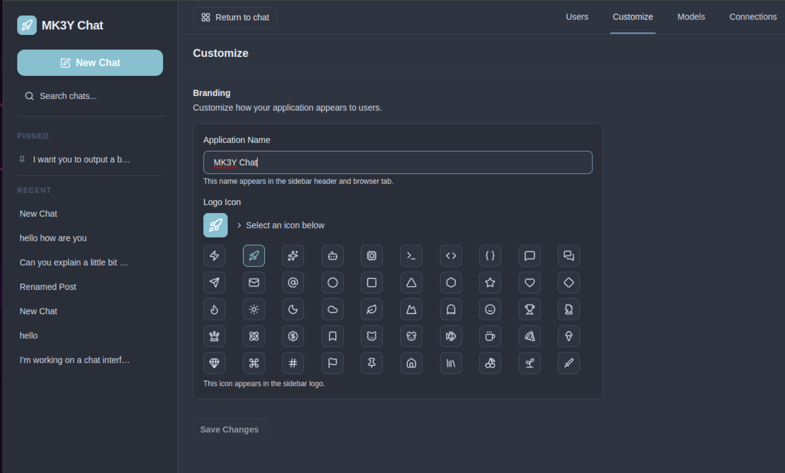

# ⚡ Faster Chat

<p align="left">
  <a href="https://preactjs.com/">
    
  </a>
  <a href="https://hono.dev/">
    
  </a>
  <a href="https://tailwindcss.com/">
    
  </a>
  <a href="https://tanstack.com/router">
    
  </a>
  <a href="https://tanstack.com/query">
    
  </a>
  <a href="https://bun.sh/docs/api/sqlite">
    
  </a>
  <a href="https://sdk.vercel.ai/">
    
  </a>
  <a href="https://bun.sh/">
    
  </a>
  <a href="https://opensource.org/licenses/MIT">
    
  </a>
</p>

> **A blazingly fast, privacy-first chat interface for AI that works with any LLM provider—cloud or completely offline.**

Connect to OpenAI, Anthropic, Google, Groq, Mistral, xAI, DeepSeek, and more—or run completely offline with [Ollama](https://ollama.ai/), [LM Studio](https://lmstudio.ai/), or [llama.cpp](https://github.com/ggml-org/llama.cpp). Your conversations stay on your machine. No vendor lock-in, no tracking, full control.



## ✨ Features

**Core**
- 💬 Real-time streaming chat with Vercel AI SDK
- ⚡ **Blazingly fast** — 3KB Preact runtime, zero SSR overhead, instant responses
- 🗄️ **Server-side SQLite storage** — Conversations persist across devices and browser tabs
- 🤖 **17 built-in providers** (plus 50+ more auto-discoverable via [models.dev](https://models.dev)): OpenAI, Anthropic, Google, Google Vertex, Amazon Bedrock, Azure, Groq, Mistral, xAI, DeepSeek, Cohere, Fireworks, Cerebras, OpenRouter, Replicate, Ollama, LM Studio
- 🧠 **Cross-conversation memory** — AI remembers your preferences, projects, and context across chats
- 🔍 **Web search** — AI can search the web and cite sources inline (Brave Search)
- 🖼️ **Image support** — Upload images for vision analysis, generate images with DALL-E, FLUX, and OpenRouter models
- 📥 **Import conversations** from ChatGPT exports (more formats coming soon)
- 📎 File attachments with preview and download
- 📝 Markdown rendering with syntax highlighting (Shiki) and LaTeX support
- 🎨 **Themable UI** — 15+ color themes, dark/light mode, custom fonts, syntax highlighting themes
- 🎤 Voice input/output — Speech-to-text and text-to-speech capabilities
- ⌨️ Keyboard shortcuts for power users (Ctrl+B sidebar, Ctrl+Shift+O new chat, etc.)
- 📱 Responsive design for desktop, tablet, and mobile

**Administration**
- 🔐 Multi-user authentication with role-based access (admin/member/readonly)
- 🔌 **Provider Hub**: Auto-discover models with [models.dev](https://models.dev) integration
- ⬇️ **Pull Ollama models** directly from Admin Panel with progress streaming (no CLI needed)
- 🛡️ Admin panel for user management (CRUD, password reset, role changes)
- 🔑 Encrypted API key storage with server-side encryption
- 🎭 **White labeling** — Customize app name and logo icon for your organization

**Deployment**
- 🌐 Works completely offline with local models (Ollama, LM Studio, etc.)
- 🐳 One-command Docker deployment with optional HTTPS via Caddy
- 🎨 Modern stack: Preact + Hono + TanStack + Tailwind 4.1

## 🧠 Memory System

Faster Chat can learn about you across conversations — your preferences, projects, tech stack, and communication style. Memories are extracted automatically after each response and injected naturally into future chats.

- **Three-level control**: Global toggle (admin), per-user toggle, per-chat opt-out
- **Zero latency impact**: Extraction happens asynchronously after the response streams
- **Full transparency**: View, delete individual facts, or clear all memories from Settings
- **Configurable extraction model**: Use a cheap/fast model (e.g., Haiku, GPT-4o-mini) to minimize cost
- **Privacy**: Memories are strictly user-scoped. No admin access to user memories.

## 🔍 Web Search

When enabled, the AI can autonomously search the web and fetch pages to answer questions with up-to-date information.

- **Brave Search** integration with encrypted API key storage
- **SSRF-protected** URL fetching with DNS validation and private IP blocking
- **Source citations** displayed as clickable pills with favicons below the response
- **Real-time status**: "Searching the web..." and "Reading {domain}" indicators during tool execution
- **5-minute cache** for repeated queries, max 5 results per search

## 🖼️ Image Support

**Vision/Multimodal**: Upload images alongside messages for analysis by vision-capable models (Claude, GPT-4, Gemini, Grok, Mistral, and more).

**Image Generation**: Toggle image mode to generate images with configurable aspect ratios (1:1, 16:9, 9:16, 4:3, 3:4, 3:2, 2:3).
- **Providers**: OpenAI (DALL-E 3), Replicate (FLUX 1.1 Pro), OpenRouter image models
- Generated images display inline with download controls and metadata

## 🚀 Quick Start

### One-Click Docker Deploy (Recommended)

```bash
git clone https://github.com/1337hero/faster-chat.git
cd faster-chat
docker compose up -d
```

That's it. Open http://localhost:8787, register your first user (becomes admin), and configure your AI providers.

**With HTTPS** (for production):
```bash
docker compose -f docker-compose.yml -f docker-compose.caddy.yml up -d
```

### Local Development

**Prerequisites**: [Bun](https://bun.sh/) (recommended) or Node.js 20+

```bash
git clone https://github.com/1337hero/faster-chat.git
cd faster-chat
bun install
bun run dev
```

**On first run**, the server automatically generates encryption keys and initializes the database.

- **Frontend**: http://localhost:3000
- **API Server**: http://localhost:3001

> **Important**: Backup `server/.env` — contains the encryption key for stored API keys.

### First-Time Setup

1. **Register an account** at http://localhost:3000/login
   - The first account is automatically promoted to admin
2. **Configure AI providers** in the Admin Panel (`/admin` → Providers tab):
   - Add OpenAI, Anthropic, or other cloud providers with API keys
   - Configure local providers (Ollama, LM Studio) with custom endpoints
   - API keys are encrypted and stored securely server-side
3. **Enable models** in the Admin Panel (Providers tab → Refresh Models)
   - Select which models appear in the chat interface
   - Set default model for new chats


*Configure providers and API keys in the Admin Panel*


*Enable and manage models from all your providers*


*New Focus Mode*


*New Appearance Options, to change colors and fonts*


*You can now white label and customize the app title and icon*


### Using Offline with Ollama

```bash
# Install Ollama (macOS/Linux)
curl -fsSL https://ollama.ai/install.sh | sh

# In Faster Chat: Admin Panel → Connections → Search "Ollama" → Add
# Then: Admin Panel → Models → Click "Pull Model" on Ollama row → Enter model name
```

You can pull models directly from the Admin Panel—no CLI needed! Just click **Pull Model** next to your Ollama provider, enter a model name (e.g., `llama3.2`, `mistral`, `codellama`), and watch the download progress in real-time.

The Provider Hub auto-discovers 50+ providers including Ollama, LM Studio, OpenAI, Anthropic, Groq, Mistral, OpenRouter, and more. Just search and add.

## 💻 Development

### Commands

**Root (recommended)**
```bash
bun run dev         # Start frontend + backend concurrently
bun run build       # Build all packages for production
bun run start       # Run production builds
bun run clean       # Remove all build artifacts
bun run format      # Format code with Prettier
```

**Frontend**
```bash
cd frontend
bun run dev         # Vite dev server on :3000
bun run build       # Production build to dist/
bun run preview     # Preview production build
```

**Backend**
```bash
cd server
bun run dev         # Hono dev server on :3001
bun run build       # Build for production
bun run start       # Run production server on :3001
```

## 🐳 Docker Details

The Docker setup uses a hybrid build (Bun for deps, Node.js 22 runtime) with SQLite storage in a persistent volume.

**HTTPS with Caddy**: For production with automatic Let's Encrypt certificates:
```bash
docker compose -f docker-compose.yml -f docker-compose.caddy.yml up -d
# Edit Caddyfile with your domain, point DNS, restart
```

See `docs/caddy-https-setup.md` and `docs/docker-setup.md` for details.

### Configuration

**Environment Variables** (`server/.env`):

```bash
# Required: Encryption key for API keys
API_KEY_ENCRYPTION_KEY=...  # Generate with crypto.randomBytes(32)

# Optional: Configure via Admin Panel instead
APP_PORT=8787              # Internal port (default: 8787)
NODE_ENV=production        # Environment mode
DATABASE_URL=sqlite:///app/server/data/chat.db

# For local Ollama access from Docker
OLLAMA_BASE_URL=http://host.docker.internal:11434
```

**Common Commands:**

```bash
docker compose up -d                # Start
docker compose logs -f              # View logs
docker compose down                 # Stop
docker compose up -d --build        # Rebuild

# Reset database
docker compose down
docker volume rm faster-chat_chat-data
docker compose up -d
```


## 🗺️ Roadmap

Faster Chat has reached its stated goal — a lighter, faster, more private alternative to Open WebUI — and is now in **maintain mode**: quality and polish over new surface area. Everything in the feature list above is shipped and working; what remains is a short list of small, finishable items, each tracked as a PRD in the [open issues](https://github.com/1337hero/faster-chat/issues).

**What's next**:
- Chat export to JSON/Markdown ([#27](https://github.com/1337hero/faster-chat/issues/27)) and Claude import ([#28](https://github.com/1337hero/faster-chat/issues/28)) — closing the data-ownership loop
- Inline message editing ([#29](https://github.com/1337hero/faster-chat/issues/29)), full-text message search ([#30](https://github.com/1337hero/faster-chat/issues/30)), per-chat system prompt/temperature ([#31](https://github.com/1337hero/faster-chat/issues/31))
- Minimal personal prompt templates ([#34](https://github.com/1337hero/faster-chat/issues/34))

**Explicitly not planned**: knowledge bases/RAG, conversation branching, model arenas, MCP, plugin systems, PostgreSQL, mobile apps, i18n, public share links. Each either grows a second product inside this one or is a permanent maintenance tax. A finished tool that stays sharp beats an ambitious one that rusts — don't become Open WebUI.

## 🎨 Design Philosophy

**Faster Chat** is built on these principles:

- **Self-Hosted**: Your data stays on your server. No cloud dependencies.
- **Provider-Agnostic**: Never locked into a single AI vendor.
- **Minimal Runtime**: 3KB Preact, no SSR overhead, instant responses.
- **Offline-Capable**: Run completely offline with local models.
- **Fast Iteration**: Bun for speed, no TypeScript ceremony, clear patterns.
- **Simple Code**: Small focused components, derive state in render, delete aggressively.

### Why No TypeScript?

We chose **speed over ceremony**. TypeScript's compile step and constant type churn across fast-moving AI SDKs slowed development more than it helped.

**Our guardrails:**
- Runtime validation at system boundaries
- Shared constants and clear contracts
- Tests for critical paths
- JSDoc for complex functions

**Trade-off:** Less friction, faster iteration, easier contribution.

See WIKI for detailed coding principles and architecture documentation.

## 🙏 Credits & Acknowledgments

**Faster Chat** is built on the shoulders of excellent open source projects:

**Core Infrastructure**
- [Vercel AI SDK](https://github.com/vercel/ai) — Streaming chat completions and multi-provider support
- [models.dev](https://github.com/sst/models.dev) — Community-maintained AI model database for auto-discovery
- [Preact](https://preactjs.com/) — Lightweight 3KB React alternative
- [Hono](https://hono.dev/) — Ultrafast web framework for the backend
- [TanStack Router](https://tanstack.com/router) & [TanStack Query](https://tanstack.com/query) — Modern routing and server state management
- [bun:sqlite](https://bun.sh/docs/api/sqlite) — Fast SQLite driver for server-side persistence

**UI & Styling**
- [Tailwind CSS](https://tailwindcss.com/) — Utility-first CSS framework
- [lucide-preact](https://lucide.dev/guide/packages/lucide-preact) — Beautiful icon library
- [Catppuccin](https://github.com/catppuccin/catppuccin) — Soothing pastel theme

**External API Calls**

For transparency, this application makes the following external API calls:
- **models.dev/api.json** — Fetches provider and model metadata on server startup (cached for 1 hour)
- **Brave Search API** — Only when web search is enabled and triggered by the AI during a conversation
- **Your configured AI providers** (OpenAI, Anthropic, etc.) — Only when you send chat messages
- **No tracking, analytics, or telemetry services** — Your privacy is paramount

All data (conversations, memories, settings, API keys) is stored in your self-hosted SQLite database. Nothing leaves your server except API calls to your configured AI providers and optional web search.

## 🤝 Contributing

Contributions welcome! We're looking for:
- Bug fixes and error handling
- New provider integrations
- Documentation improvements
- UI/UX enhancements
- Tests and quality improvements

**Before submitting:**
1. Read Documentation for coding philosophy and patterns
2. Ensure changes align with our lightweight, offline-first approach
3. Test locally with `bun run dev`
4. Keep PRs focused on a single feature or fix

## 📄 License

MIT License — see [LICENSE](LICENSE) for details.

---

## ⭐ Star History

If Faster Chat helps you take control of your AI conversations, consider giving us a star!

[](https://www.star-history.com/#1337hero/faster-chat&type=date&legend=top-left)

---

<p align="center">
  <strong>Built with ❤️ by <a href="https://github.com/1337hero" target="_blank">1337Hero</a> for developers who value privacy, speed, and control.</strong><br>
  <sub>No tracking. No analytics. Just fast, local-first AI conversations.</sub>
</p>
